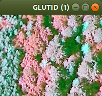

# imv
minimalist hyperspectral image viewer. band switching by r[number]&lt;return>, g[number]&lt;return>, b[number]&lt;return>

##Example: default bands (r,g,b = 1,2,3) natural colour

##Example: band selection (r,g,b = 4,3,2) so-called false colour

